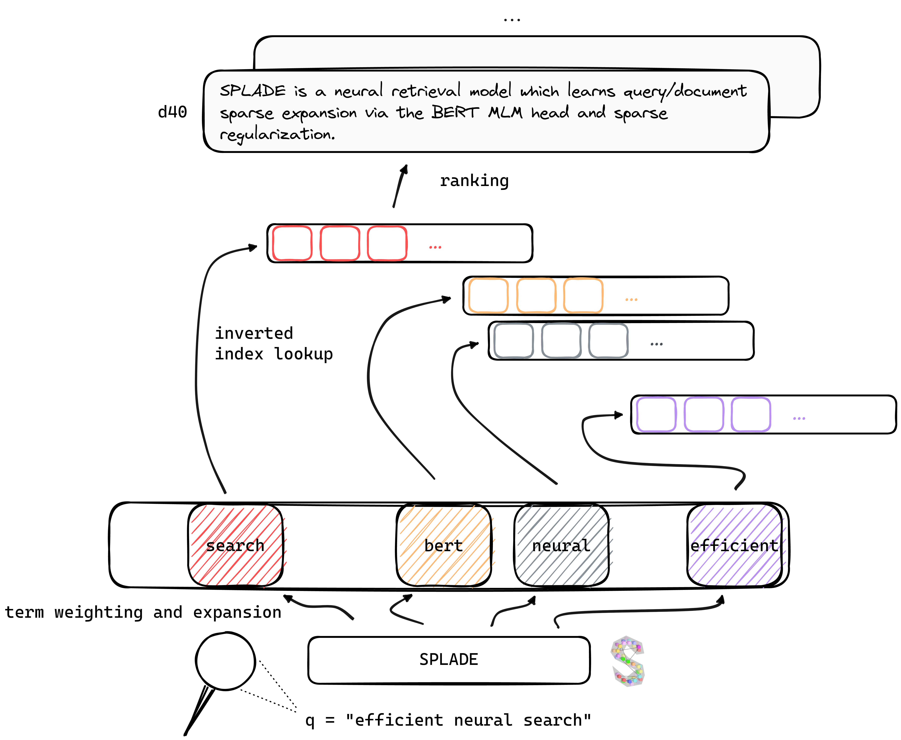

# SPLADE

**SP**arse **L**exical **A**n**D** **E**xpansion Model for First Stage Ranking

[](https://arxiv.org/abs/2107.05720)
[](https://europe.naverlabs.com/blog/splade-a-sparse-bi-encoder-bert-based-model-achieves-effective-and-efficient-first-stage-ranking/)
[](https://huggingface.co/naver)
[](https://europe.naverlabs.com/research/machine-learning-and-optimization/splade-models/)



This repository contains the code to perform **training**, **indexing** and **retrieval** for SPLADE models. It also
includes everything needed to launch evaluation on the [BEIR](https://github.com/beir-cellar/beir) benchmark.

**TL; DR**
SPLADE is a neural retrieval model which learns query/document **sparse** expansion via the BERT MLM head and sparse
regularization. Sparse representations benefit from several advantages compared to dense approaches: efficient use of
inverted index, explicit lexical match, interpretability... They also seem to be better at generalizing on out-of-domain
data (BEIR benchmark).

* (v1, SPLADE) [SPLADE: Sparse Lexical and Expansion Model for First Stage Ranking](https://arxiv.org/abs/2107.05720), *Thibault Formal*, *Benjamin Piwowarski*
  and *Stéphane Clinchant*. SIGIR21 short paper.

By benefiting from recent advances in training neural retrievers, our **v2** models rely on hard-negative mining,
distillation and better Pre-trained Language Model initialization to further increase their **effectiveness**, on both
in-domain (MS MARCO) and out-of-domain evaluation (BEIR benchmark).

* (v2, SPLADE v2) [SPLADE v2: Sparse Lexical and Expansion Model for Information Retrieval](https://arxiv.org/abs/2109.10086), *Thibault Formal*, *Benjamin
  Piwowarski*, *Carlos Lassance*, and *Stéphane Clinchant*. arxiv.
* (v2bis, SPLADE++) [From Distillation to Hard Negative Sampling: Making Sparse Neural IR Models More Effective](http://arxiv.org/abs/2205.04733), *Thibault
  Formal*, *Carlos Lassance*, *Benjamin Piwowarski*, and *Stéphane Clinchant*. SIGIR22 short paper (*extension of SPLADE v2*).

Finally, by introducing several modifications (query specific regularization, disjoint encoders etc.), we are able to improve **efficiency**, achieving latency on par with BM25 under the same computing constraints.

* (efficient SPLADE) [An Efficiency Study for SPLADE Models](https://dl.acm.org/doi/10.1145/3477495.3531833), *Carlos Lassance* and *Stéphane Clinchant*. SIGIR22 short paper.

Weights for models trained under various settings can be found
on [Naver Labs Europe website](https://europe.naverlabs.com/research/machine-learning-and-optimization/splade-models/),
as well as [Hugging Face](https://huggingface.co/naver). Please bear in mind that SPLADE is more a class of models
rather than a model per se: depending on the regularization magnitude, we can obtain different models (from very sparse
to models doing intense query/doc expansion) with different properties and performance.

*splade: a spork that is sharp along one edge or both edges, enabling it to be used as a knife, a fork and a spoon.*

***

# Getting started :rocket:

## Requirements

*In order to get the weights from this repo, be sure to have git lfs installed (not mandatory).* We recommend to start
from a fresh environment, and install the packages from `conda_splade_env.yml`.

```
conda create -n splade_env python=3.9
conda activate splade_env
conda env create -f conda_splade_env.yml
```

## Usage

### Playing with the model

`inference_splade.ipynb` allows you to load and perform inference with a trained model, in order to inspect the
predicted "bag-of-expanded-words". We provide weights for six main models:

| model | MRR@10 (MS MARCO dev) | 
| --- | --- |
| `splade_max` (**v2**) | 34.0 |
| `distilsplade_max` (**v2**) | 36.8 |
| `naver/splade-cocondenser-selfdistil` (**SPLADE++**, [HF](https://huggingface.co/naver/splade-cocondenser-selfdistil)) | 37.6 | 
| `naver/splade-cocondenser-ensembledistil` (**SPLADE++**, [HF](https://huggingface.co/naver/splade-cocondenser-ensembledistil)) | 38.3 |
| `naver/efficient-splade-V-large-doc` ([HF](https://huggingface.co/naver/efficient-splade-V-large-doc)) + `naver/efficient-splade-V-large-query` ([HF](https://huggingface.co/naver/efficient-splade-V-large-query)) (**efficient SPLADE**) | 38.8 |
| `naver/efficient-splade-VI-BT-large-doc` ([HF](https://huggingface.co/naver/efficient-splade-VI-BT-large-doc)) + `efficient-splade-VI-BT-large-query` ([HF](https://huggingface.co/naver/efficient-splade-VI-BT-large-query)) (**efficient SPLADE**) | 38.0 |


We also uploaded various
models [here](https://europe.naverlabs.com/research/machine-learning-and-optimization/splade-models/). Feel free to try
them out!

### High level overview of the code structure

* This repository lets you either train (`train.py`), index (`index.py`), retrieve (`retrieve.py`) (or perform every
  step with `all.py`) SPLADE models.
* To manage experiments, we rely on [hydra](https://github.com/facebookresearch/hydra). Please refer
  to [conf/README.md](conf/README.md) for a complete guide on how we configured experiments.

### Data

* To train models, we rely on [MS MARCO](https://github.com/microsoft/MSMARCO-Passage-Ranking) data.
* We also further rely on distillation and hard negative mining, from available
  datasets ([Margin MSE Distillation](https://github.com/sebastian-hofstaetter/neural-ranking-kd)
  , [Sentence Transformers Hard Negatives](https://huggingface.co/datasets/sentence-transformers/msmarco-hard-negatives))
  or datasets we built ourselves (e.g. negatives mined from SPLADE).
* Most of the data formats are pretty standard; for validation, we rely on an approximate validation set, following a
  setting similar to [TAS-B](https://arxiv.org/abs/2104.06967).

To simplify setting up, we made available all our data folders, which can
be [downloaded here](https://download.europe.naverlabs.com/splade/sigir22/data.tar.gz). This link includes queries,
documents and hard negative data, allowing for training under the `EnsembleDistil` setting (see v2bis paper). For
other settings (`Simple`, `DistilMSE`, `SelfDistil`), you also have to download:

* [(`Simple`) standard BM25 Triplets](https://download.europe.naverlabs.com/splade/sigir22/triplets.tar.gz)
* [(`DistilMSE`) "Vienna" triplets for MarginMSE distillation](https://www.dropbox.com/s/sl07yvse3rlowxg/vienna_triplets.tar.gz?dl=0)
* [(`SelfDistil`) triplets mined from SPLADE](https://download.europe.naverlabs.com/splade/sigir22/splade_triplets.tar.gz)

After downloading, you can just untar in the root directory, and it will be placed in the right folder.

```
tar -xzvf file.tar.gz
```

### Quick start

In order to perform all steps (here on toy data, i.e. `config_default.yaml`), go on the root directory and run:

```bash
conda activate splade_env
export PYTHONPATH=$PYTHONPATH:$(pwd)
export SPLADE_CONFIG_NAME="config_default.yaml"
python3 -m splade.all \
  config.checkpoint_dir=experiments/debug/checkpoint \
  config.index_dir=experiments/debug/index \
  config.out_dir=experiments/debug/out
```

### Additional examples

We provide additional examples that can be plugged in the above code. See [conf/README.md](conf/README.md) for details
on how to change experiment settings.

* you can similarly run training `python3 -m splade.train` (same for indexing or retrieval)
* to create Anserini readable files (after training),
  run `SPLADE_CONFIG_FULLPATH=/path/to/checkpoint/dir/config.yaml python3 -m splade.create_anserini +quantization_factor_document=100 +quantization_factor_query=100`
* config files for various settings (distillation etc.) are available in `/conf`. For instance, to run the `SelfDistil`
  setting:
    * change to `SPLADE_CONFIG_NAME=config_splade++_selfdistil.yaml`
    * to further change parameters (e.g. lambdas) *outside* the config,
      run: `python3 -m splade.all config.regularizer.FLOPS.lambda_q=0.06 config.regularizer.FLOPS.lambda_d=0.02`

We provide several base configurations which correspond to the experiments in the v2bis and "efficiency" papers. Please note that these are
suited for our hardware setting, i.e. 4 GPUs Tesla V100 with 32GB memory. In order to train models with e.g. one GPU,
you need to decrease the batch size for training and evaluation. Also note that, as the range for the loss might change
with a different batch size, corresponding lambdas for regularization might need to be adapted. However, we provide a mono-gpu configuration
`config_splade++_cocondenser_ensembledistil_monogpu.yaml` for which we obtain 37.2 MRR@10, trained on a single 16GB GPU.

### Evaluating a pre-trained model

Indexing (and retrieval) can be done either using our (numba-based) implementation of inverted index,
or [Anserini](https://github.com/castorini/anserini). Let's perform these steps using an available model (`naver/splade-cocondenser-ensembledistil`).

```bash
conda activate splade_env
export PYTHONPATH=$PYTHONPATH:$(pwd)
export SPLADE_CONFIG_NAME="config_splade++_cocondenser_ensembledistil"
python3 -m splade.index \
  init_dict.model_type_or_dir=naver/splade-cocondenser-ensembledistil \
  config.pretrained_no_yamlconfig=true \
  config.index_dir=experiments/pre-trained/index
python3 -m splade.retrieve \
  init_dict.model_type_or_dir=naver/splade-cocondenser-ensembledistil \
  config.pretrained_no_yamlconfig=true \
  config.index_dir=experiments/pre-trained/index \
  config.out_dir=experiments/pre-trained/out
# pretrained_no_yamlconfig indicates that we solely rely on a HF-valid model path
``` 

* To change the data, simply override the hydra retrieve_evaluate package, e.g. add `retrieve_evaluate=msmarco` as argument of `splade.retrieve`.

You can similarly build the files that will be ingested by Anserini:

```bash
python3 -m splade.create_anserini \
  init_dict.model_type_or_dir=naver/splade-cocondenser-ensembledistil \
  config.pretrained_no_yamlconfig=true \
  config.index_dir=experiments/pre-trained/index \
  +quantization_factor_document=100 \
  +quantization_factor_query=100
```

It will create the json collection (`docs_anserini.jsonl`) as well as the queries (`queries_anserini.tsv`) that are
needed for Anserini. You then just need to follow the regression for
SPLADE [here](https://github.com/castorini/anserini/blob/master/docs/regressions-msmarco-passage-distill-splade-max.md) in order to index and retrieve.

### BEIR eval

You can also run evaluation on BEIR, for instance:

```bash
conda activate splade_env
export PYTHONPATH=$PYTHONPATH:$(pwd)
export SPLADE_CONFIG_FULLPATH="/path/to/checkpoint/dir/config.yaml"
for dataset in arguana fiqa nfcorpus quora scidocs scifact trec-covid webis-touche2020 climate-fever dbpedia-entity fever hotpotqa nq
do
    python3 -m splade.beir_eval \
      +beir.dataset=$dataset \
      +beir.dataset_path=data/beir \
      config.index_retrieve_batch_size=100
done
```

### PISA evaluation

We provide in `efficient_splade_pisa/README.md` the steps to evaluate efficient SPLADE models with PISA.

***

# Cite :scroll:

Please cite our work as:

* (v1) SIGIR21 short paper

```
@inbook{10.1145/3404835.3463098,
author = {Formal, Thibault and Piwowarski, Benjamin and Clinchant, St\'{e}phane},
title = {SPLADE: Sparse Lexical and Expansion Model for First Stage Ranking},
year = {2021},
isbn = {9781450380379},
publisher = {Association for Computing Machinery},
address = {New York, NY, USA},
url = {https://doi.org/10.1145/3404835.3463098},
booktitle = {Proceedings of the 44th International ACM SIGIR Conference on Research and Development in Information Retrieval},
pages = {2288–2292},
numpages = {5}
}
```

* (v2) arxiv

```
@misc{https://doi.org/10.48550/arxiv.2109.10086,
  doi = {10.48550/ARXIV.2109.10086},
  url = {https://arxiv.org/abs/2109.10086},
  author = {Formal, Thibault and Lassance, Carlos and Piwowarski, Benjamin and Clinchant, Stéphane},
  keywords = {Information Retrieval (cs.IR), Artificial Intelligence (cs.AI), Computation and Language (cs.CL), FOS: Computer and information sciences, FOS: Computer and information sciences},
  title = {SPLADE v2: Sparse Lexical and Expansion Model for Information Retrieval},
  publisher = {arXiv},
  year = {2021},
  copyright = {Creative Commons Attribution Non Commercial Share Alike 4.0 International}
}
```

* (v2bis) SPLADE++, SIGIR22 short paper

```
@inproceedings{10.1145/3477495.3531857,
author = {Formal, Thibault and Lassance, Carlos and Piwowarski, Benjamin and Clinchant, St\'{e}phane},
title = {From Distillation to Hard Negative Sampling: Making Sparse Neural IR Models More Effective},
year = {2022},
isbn = {9781450387323},
publisher = {Association for Computing Machinery},
address = {New York, NY, USA},
url = {https://doi.org/10.1145/3477495.3531857},
doi = {10.1145/3477495.3531857},
abstract = {Neural retrievers based on dense representations combined with Approximate Nearest Neighbors search have recently received a lot of attention, owing their success to distillation and/or better sampling of examples for training -- while still relying on the same backbone architecture. In the meantime, sparse representation learning fueled by traditional inverted indexing techniques has seen a growing interest, inheriting from desirable IR priors such as explicit lexical matching. While some architectural variants have been proposed, a lesser effort has been put in the training of such models. In this work, we build on SPLADE -- a sparse expansion-based retriever -- and show to which extent it is able to benefit from the same training improvements as dense models, by studying the effect of distillation, hard-negative mining as well as the Pre-trained Language Model initialization. We furthermore study the link between effectiveness and efficiency, on in-domain and zero-shot settings, leading to state-of-the-art results in both scenarios for sufficiently expressive models.},
booktitle = {Proceedings of the 45th International ACM SIGIR Conference on Research and Development in Information Retrieval},
pages = {2353–2359},
numpages = {7},
keywords = {neural networks, indexing, sparse representations, regularization},
location = {Madrid, Spain},
series = {SIGIR '22}
}
```

* efficient SPLADE, SIGIR22 short paper

```
@inproceedings{10.1145/3477495.3531833,
author = {Lassance, Carlos and Clinchant, St\'{e}phane},
title = {An Efficiency Study for SPLADE Models},
year = {2022},
isbn = {9781450387323},
publisher = {Association for Computing Machinery},
address = {New York, NY, USA},
url = {https://doi.org/10.1145/3477495.3531833},
doi = {10.1145/3477495.3531833},
abstract = {Latency and efficiency issues are often overlooked when evaluating IR models based on Pretrained Language Models (PLMs) in reason of multiple hardware and software testing scenarios. Nevertheless, efficiency is an important part of such systems and should not be overlooked. In this paper, we focus on improving the efficiency of the SPLADE model since it has achieved state-of-the-art zero-shot performance and competitive results on TREC collections. SPLADE efficiency can be controlled via a regularization factor, but solely controlling this regularization has been shown to not be efficient enough. In order to reduce the latency gap between SPLADE and traditional retrieval systems, we propose several techniques including L1 regularization for queries, a separation of document/query encoders, a FLOPS-regularized middle-training, and the use of faster query encoders. Our benchmark demonstrates that we can drastically improve the efficiency of these models while increasing the performance metrics on in-domain data. To our knowledge, we propose the first neural models that, under the same computing constraints, achieve similar latency (less than 4ms difference) as traditional BM25, while having similar performance (less than 10% MRR@10 reduction) as the state-of-the-art single-stage neural rankers on in-domain data.},
booktitle = {Proceedings of the 45th International ACM SIGIR Conference on Research and Development in Information Retrieval},
pages = {2220–2226},
numpages = {7},
keywords = {splade, sparse representations, latency, information retrieval},
location = {Madrid, Spain},
series = {SIGIR '22}
}
```

***

# Contact :mailbox_with_no_mail:

Feel free to contact us via [Twitter](https://twitter.com/thibault_formal) or by mail @ thibault.formal@naverlabs.com !

# License

SPLADE Copyright (c) 2021-present NAVER Corp.

SPLADE is licensed under a Creative Commons Attribution-NonCommercial-ShareAlike 4.0 International License.
(see [license](license.txt))

You should have received a copy of the license along with this work. If not,
see http://creativecommons.org/licenses/by-nc-sa/4.0/ .
