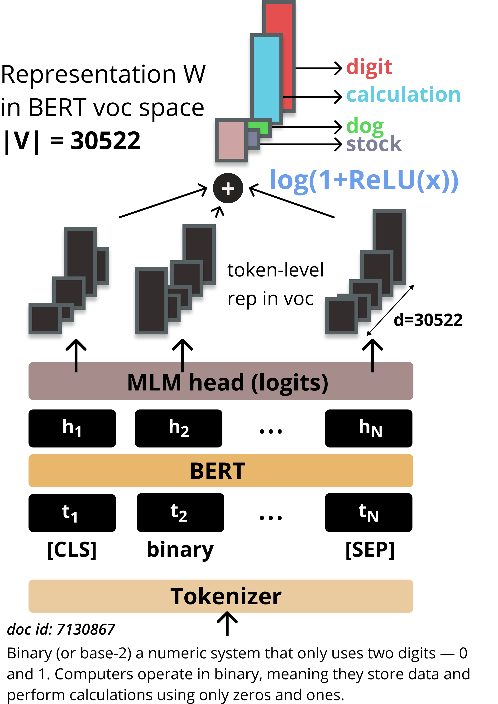
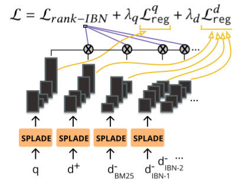
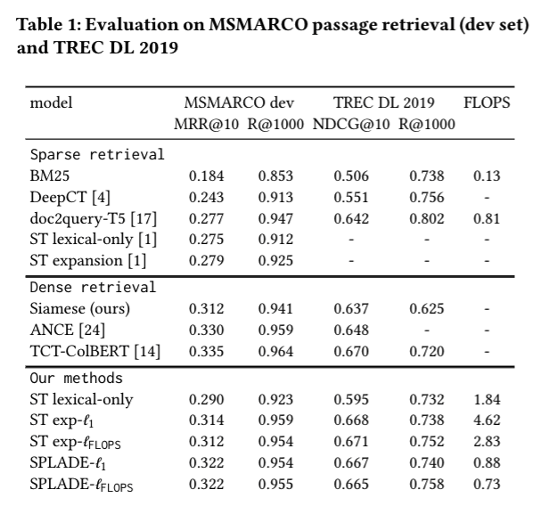
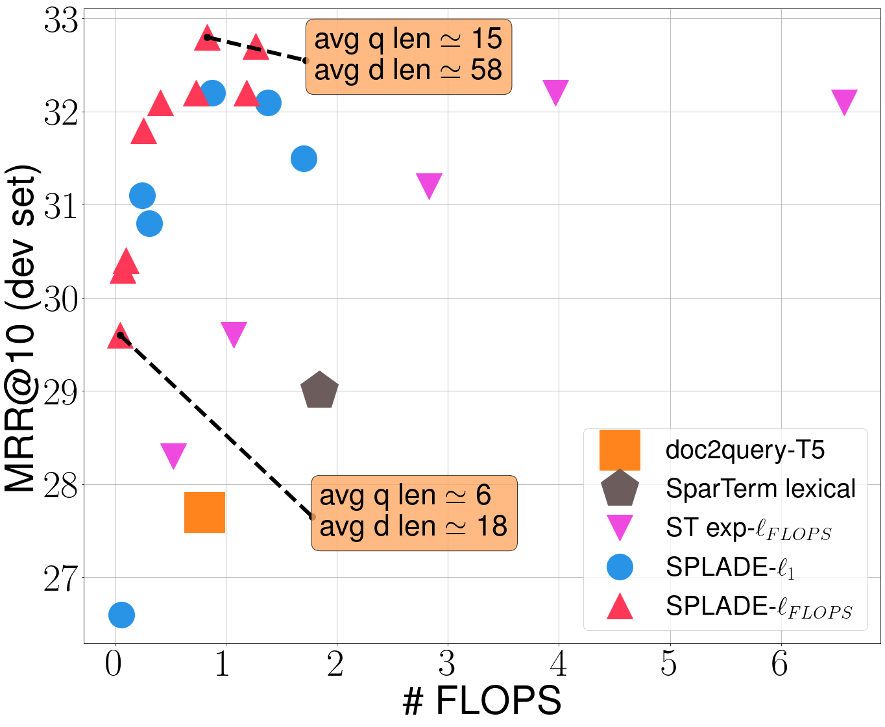

# SPLADE :fork_and_knife:+ :spoon: = :mag_right:

This repository contains the weights for two models as well as the code for running inference for our SIGIR21 paper:
**SPLADE: Sparse Lexical and Expansion Model for First Stage Ranking**, *Thibault Formal*, *Benjamin Piwowarski* and *
Stéphane Clinchant*.

**TL; DR**  
Recently, dense retrieval with approximate nearest neighbors search based on BERT has demonstrated its strength for
first-stage retrieval, questioning the competitiveness of traditional sparse models like BM25. In this work, we have
proposed SPLADE, a sparse model revisiting query/document expansion. Our approach relies on in-batch negatives,
logarithmic activation and FLOPS regularization to learn effective and efficient sparse representations. SPLADE is an
appealing candidate for first-stage retrieval: it rivals the latest state-of-the-art dense retrieval models, its
training procedure is straightforward, and its efficiency (sparsity/FLOPS) can be controlled explicitly through the
regularization such that it can be operated on inverted indexes. In reason of its simplicity, SPLADE is a solid basis
for further improvements in this line of research.

*splade: a spork that is sharp along one edge or both edges, enabling it to be used as a knife, a fork and a spoon.*

## SPLADE

We give a brief overview of the model architecture and the training strategy. Please refer to the paper for further
details ! You can also have a look at
our [blogpost](https://europe.naverlabs.com/blog/splade-a-sparse-bi-encoder-bert-based-model-achieves-effective-and-efficient-first-stage-ranking/)
for additional insights and examples ! Feel also free to contact us via [Twitter](https://twitter.com/thibault_formal)
or mail @ thibault.formal@naverlabs.com !

SPLADE architecture (see below) is rather simple: queries/documents are fed to BERT, and we rely on the MLM head used
for pre-training to actually predict term importance *in BERT vocabulary space*. Thus, the model implicitly learns
expansion. We also added a log activation that greatly helped making the representations sparse. Relevance is computed
via dot product.

<p align="center">

</p>

The model thus represents queries and documents in the vocabulary space. In order to make these representations sparse
-- so that we can use an inverted index, we explicitly train the model with regularization on q/d representations (**L1** or **FLOPS**) as shown below:

<p align="center">

</p>

SPLADE learns how to balance between effectiveness (via the ranking loss) and efficiency (via the regularization loss).
By controlling lambda, we can adjust the trade-off.

## How to use the code for inference

* See `inference_SPLADE.ipynb`.

### Requirements

Requirements can be found in `requirements.txt`. *In order to get the weights, be sure to have git lfs installed.*

## Main Results on MSMARCO (dev set) and TREC DL 2019 passage ranking

- Below is a table of results comparing SPLADE to several competing baselines:

<p align="center">
 
</p>

- One can adjust the regularization strength for SPLADE to reach the optimal tradeoff between performance and
  efficiency:

<p align="center">
 
</p>

## TRAINING CODE

**coming soon** :eyes:

## Cite

Please cite our work as:

```
@inproceedings{Formal2021_splade,
 author = {Thibault Formal, Benjamin Piwowarski and Stéphane Clinchant},
 title = {{SPLADE: Sparse Lexical and Expansion Model for First Stage Ranking}},
 booktitle = {Proc. of SIGIR},
 year = {2021},
}
```

## License

SPLADE 
Copyright (c) 2021-present NAVER Corp.

SPLADE is licensed under a
Creative Commons Attribution-NonCommercial-ShareAlike 4.0 International License.
(see [license](license.txt))

You should have received a copy of the license along with this
work. If not, see http://creativecommons.org/licenses/by-nc-sa/4.0/ .
